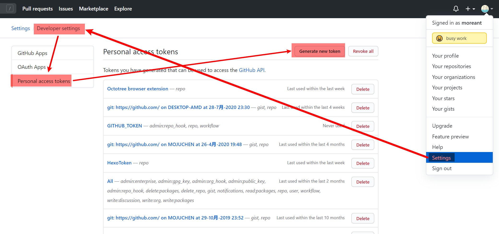
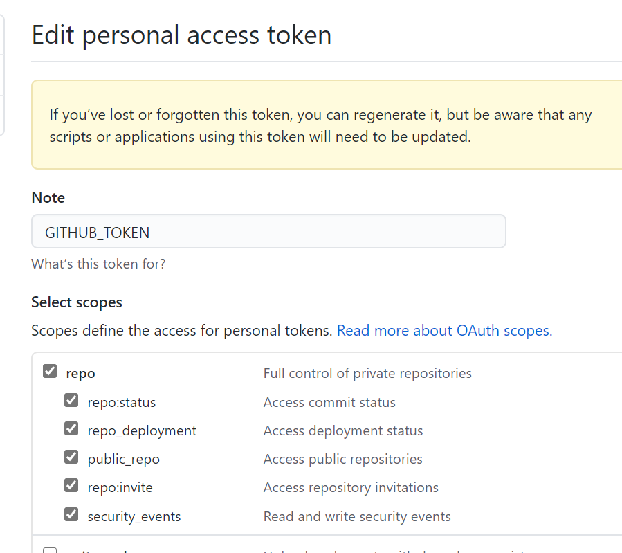
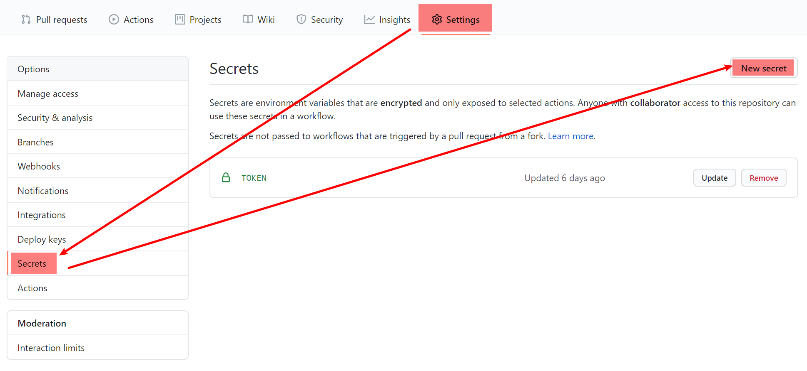
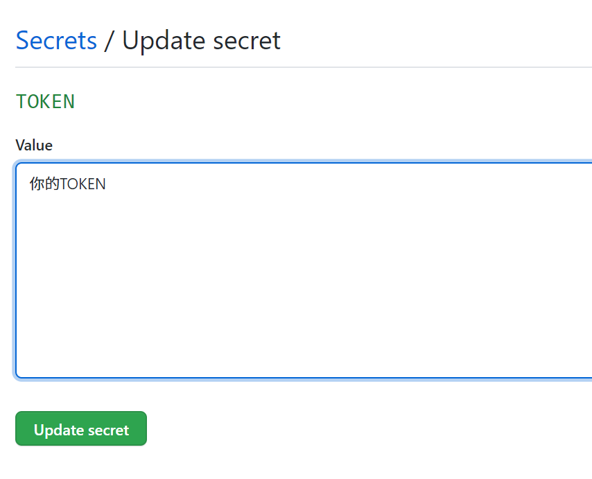
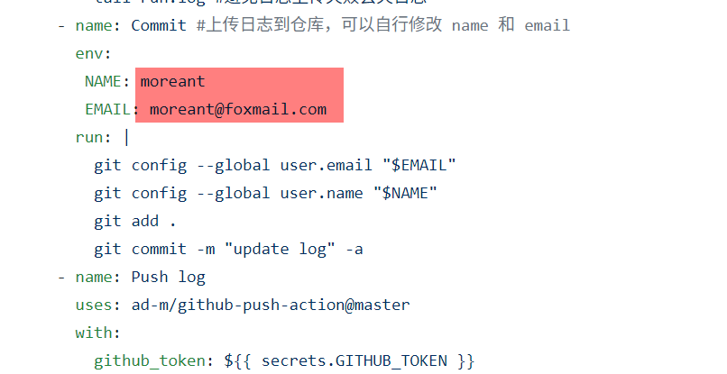

身为一个懒狗，并不想每天为了签到奖励而特意记住打开网站去签到。所幸有些网站的签到 API 非常的简易，通过简单的 CURL + Github Actions 即可完成每天定时签到。

脚本主要参考 [AutoApiSecret](https://github.com/wangziyingwen/AutoApiSecret)

0.  给我点个 star ，谢谢。

1. Fork 到自己的仓库
2. 添加 GITHUB_TOKEN 用于更新日志 （看不到图请翻墙或自我脑补）

2. 添加仓库的 Secrets 用于保存用户信息

4. 修改 `.yml` 文件里的用户名和邮箱为自己的

5. 一定要给自己的仓库点一次 star 才会启动定时任务。之后想要手动运行也可以点两下 star 

